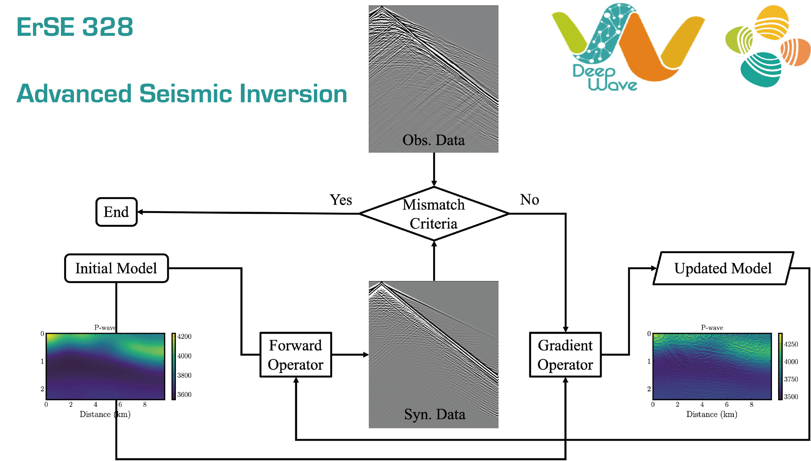

This repo contains materials for the course ErSE328 Advanced Seismic Inversion course taught by Professor Tariq Alkhalifah at King Abdullah University of Science(KAUST).


# Project structure
This repository is organized as follows:

* :open_file_folder: **package**: **Ignore**
* :open_file_folder: **asset**: **Ignore**
* :open_file_folder: **data**: folder containing data for the assignments
* :open_file_folder: **notebooks**: set of Jupyter Notebook-based assignments
* :open_file_folder: **scripts**: **Ignore**
  
# Getting started

Throughout the computational part of the course, we will mainly be utilizing the Deepwave Python library which you can access from their [repository](https://github.com/ar4/deepwave?tab=readme-ov-file). To get yourself started, you can directly learn the Deepwave fundamentals from their [documentations](https://ausargeo.com/deepwave/).

To successfully install the required environment, I highly recommend using a Linux system and ensuring your machine has a GPU. (Ibex would be a great choice)

**Step 1.1** Install Anaconda (if not already installed)

you can find the Linux version of Anaconda in [Anaconda](https://repo.anaconda.com/archive/). Then you can install a suitable Anaconda package by running (for example I use "https://repo.anaconda.com/archive/Anaconda3-2024.10-1-Linux-x86_64.sh" )

```
wget https://repo.anaconda.com/archive/Anaconda3-2024.10-1-Linux-x86_64.sh
```
**Step 1.2**: Run the installer script
```
chmod +x Anaconda3-2024.10-1-Linux-x86_64.sh
```
```
sh Anaconda3-2024.10-1-Linux-x86_64.sh
```
**Step 1.3**: Initialize Anaconda 
```
source ~/.bashrc
```
After installing the anaconda package, typing 
```
conda -V
```
to testify whether you have installed Anaconda successfully

**Step 2.1**: To install the Deepwave environment, run the following command:
```
sh install_env.sh
```
It will take some time, but if, in the end, you see the word Done! on your terminal, you are ready to go.

**Step 2.2**: Remember to always activate the environment by typing:
```
conda activate erse328asi
```
## Run a notebook on KAUST's Ibex

First connect to Ibex using your KAUST credential.

```
ssh USERNAME@glogin.ibex.kaust.edu.sa
```
Then, clone this repository and install the `erse328asi` conda environment. If it is installed please go ahead with the following command. If not, please refer to this [documentation](https://docs.anaconda.com/free/miniconda/) to install conda. Run the following command to submit the slurm jupyter notebook request.

```
sbatch erse328asi_notebook.slurm

```

You can connect from your workstation to access the notebook with the instructions from the output slurm job. The file is in the format of `slurm-JOBID.out`.

```
ssh -L 6789:GPUID:6789 USERNAME@glogin.ibex.kaust.edu.sa
```

where the `JOBID` and `GPUID` are the unique identifiers from the slurm output job request. Then, access the `http://localhost:6789/` link from your workstation and fill in the credential from the `slurm-JOBID.out`.

## Notebooks
The following notebooks are provided:

- :orange_book: ``notebooks/01_marmousi/notebook.ipynb``: First assignment (**Deadline: March 6th**)
- :orange_book: ``notebooks/02_multiscale/notebook.ipynb``: Second assignment (**Deadline: March 20th**)


